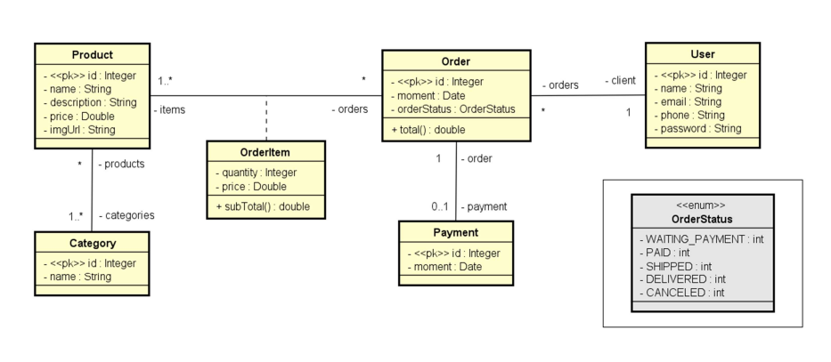

# Projeto Spring Boot JPA

## Descrição

Este projeto é uma aplicação CRUD (Create, Read, Update, Delete) desenvolvida com Spring Boot e JPA. Ele demonstra as operações básicas de persistência de dados em um banco de dados relacional.

## Diagrama de Modelo de Domínio

Abaixo está o diagrama do modelo de domínio usado no projeto:



### Explicação do Modelo de Domínio

O modelo de domínio reflete a estrutura das principais entidades do sistema e seus relacionamentos. Ele foi projetado para representar um sistema de gerenciamento de pedidos, incluindo clientes, produtos e pagamentos. A seguir, as principais entidades e seus papéis no sistema:

#### **Entidades e Atributos**
- **User (Cliente):**
  - `id`: Identificador único do cliente.
  - `name`: Nome do cliente.
  - `email`: Endereço de e-mail do cliente.
  - `phone`: Número de telefone do cliente.
  - `password`: Senha para autenticação.

- **Order (Pedido):**
  - `id`: Identificador único do pedido.
  - `moment`: Data e hora do pedido.
  - `orderStatus`: Status do pedido, utilizando o enum `OrderStatus` (ex.: WAITING_PAYMENT, PAID).

- **OrderItem (Item do Pedido):**
  - `quantity`: Quantidade do produto no pedido.
  - `price`: Preço do produto no momento do pedido.
  - `subTotal()`: Método para calcular o subtotal (quantidade × preço).

- **Product (Produto):**
  - `id`: Identificador único do produto.
  - `name`: Nome do produto.
  - `description`: Descrição do produto.
  - `price`: Preço do produto.
  - `imgUrl`: URL de uma imagem ilustrativa do produto.

- **Category (Categoria):**
  - `id`: Identificador único da categoria.
  - `name`: Nome da categoria.

- **Payment (Pagamento):**
  - `id`: Identificador único do pagamento.
  - `moment`: Data e hora do pagamento.

#### **Relacionamentos**
- Um **User** pode ter vários **Orders** (relação 1:N).
- Um **Order** pode conter vários **OrderItems** (relação 1:N), e cada item está associado a um único **Product**.
- Um **Product** pode pertencer a várias **Categories** (relação N:N).
- Um **Order** pode ter um único **Payment**, mas o pagamento é opcional (relação 1:0..1).

#### **Enum OrderStatus**
O enum `OrderStatus` define os possíveis estados de um pedido:
- `WAITING_PAYMENT`: Aguardando pagamento.
- `PAID`: Pago.
- `SHIPPED`: Enviado.
- `DELIVERED`: Entregue.
- `CANCELED`: Cancelado.


## Funcionalidades

- Criação de registros
- Leitura de registros
- Atualização de registros
- Exclusão de registros

## Tecnologias Utilizadas

- Java
- Spring Boot
- Spring Data JPA
- Banco de Dados H2 (ou outro de sua preferência)
- Maven

## Pré-requisitos

- Java 11 ou superior
- Maven 3.6.3 ou superior

## Como Executar o Projeto

1. **Clone o repositório:**

   ```bash
   git clone https://github.com/srloris/springboot-jpa.git
   cd springboot-jpa
   ```

2. **Configure o banco de dados:**

   Por padrão, o projeto está configurado para usar o banco de dados H2 em memória. Se desejar usar outro banco de dados, atualize as configurações em `src/main/resources/application.properties`.

3. **Compile e execute a aplicação:**

   ```bash
   mvn spring-boot:run
   ```

4. **Acesse a aplicação:**

   Abra o navegador e vá para `http://localhost:8080`.

## Estrutura do Projeto

- **src/main/java**: Contém o código-fonte Java.
- **src/main/resources**: Contém recursos como arquivos de configuração.

## Contribuição

Contribuições são bem-vindas! Sinta-se à vontade para abrir issues ou enviar pull requests.

## Licença

Este projeto está licenciado sob a [MIT License](LICENSE).

## Contato

Para mais informações, entre em contato:

- Nome: Lorenzo Bastos Nunez
- Email: lorenzobnunez@hotmail.com
- LinkedIn: [Seu Perfil](https://www.linkedin.com/in/lorenzo-bastos-nunez/)
